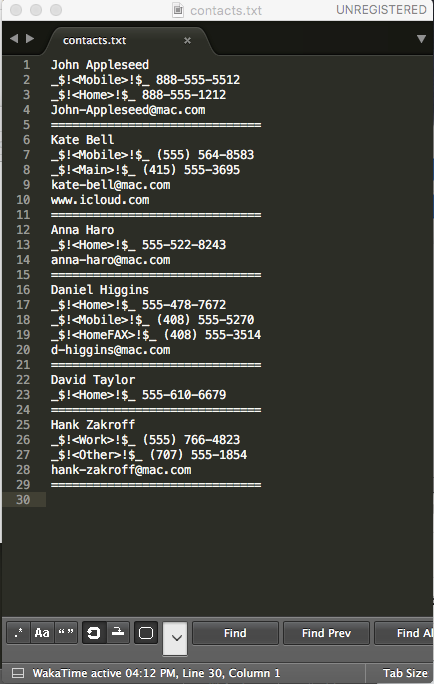
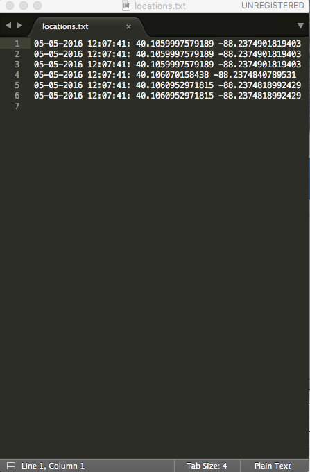

# iOS Security Project
### Overview
For this project I created an iOS App to gather information from a device and have the capability to upload the data to a FTP server. The app will collect all of the phone's contacts, images, and location coordinates and upload them to the server. The user does have to approve the app for the various permission, but in theory this code could be placed in any app including any app that is attempting to masquerade as something else. I demonstrated this by changing my app's target to Facebook. By doing this any permission request from the app will look like it is coming from Facebook.

#### App Delivery
In order to install this app on a user's device you can use Xcode’s ad-hoc deployment. With ad-hoc deployment you can add an install link to any webpage that will prompt a user to install the app. When building the app in Xcode you just need to export an app IPA file along with a manifest.

Example for ad-hoc install link:
 
`
<a href="itms-services://?action=download-manifest&url=https://192.168.88.51:1234/app/manifest.plist">Install my app!</a>
`

If the app is installed on a user's device it can also be opened via a url, which will trigger all of the information to be collected and uploaded. When the link is tapped the user's device will open a prompt with the name of your app target, which can again be set to anything. 

Example link to open the app: 
`
<a href="MyAppName://">Open the app</a>
`

